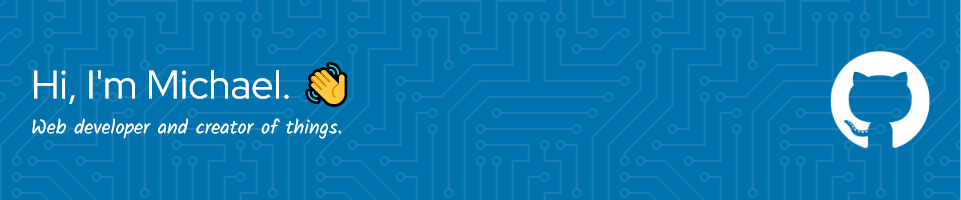

  

I'm a web developer with 3+ years of experience designing and developing web applications. At my prior place of employment, I primarily used React, sass, PHP and MySQL. I also have experience with a variety of other web frameworks and languages through building personal projects. In my free time, I enjoy playing video games, board games, reading and golfing. I am currently open to employment and working on personal projects.

### <ins>What I'm Working On</ins>
- Developing extensions for Raycast.
- Creating Minecraft Mods, Datapacks and Modpacks. Repositories can be found .

---

  

### 💻 Languages

### 🎨 Styling

### 📦 Frameworks / Packages

### 🛠️ Software / Tools 

### 🌐 Domains & Hosting

